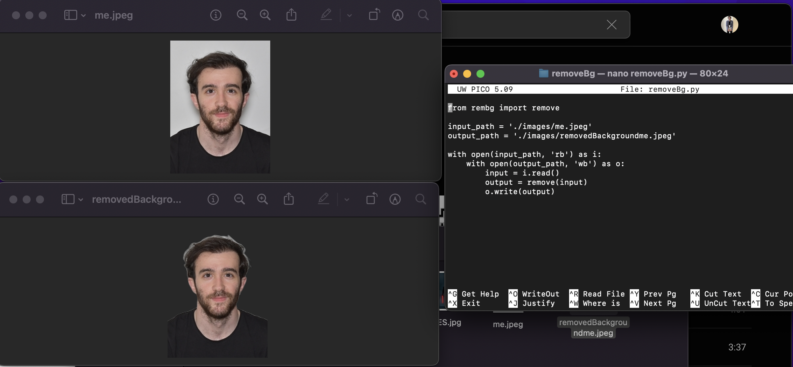

# Background Remover

<table style="margin: 0 auto;">
        <tr>
            <td></td>
            <td></td>
        </tr>
</table>


Background Remover is a script that utilizes the remove.bg API to remove the background from an image, leaving the subject or object isolated. This can be useful for creating visually appealing images, isolating objects, or preparing images for various design purposes.

## Prerequisites

Before using this script, ensure you have the following requirements in place:

- Python 3.6 or higher
- An internet connection to access the remove.bg API (if applicable)
- The `rembg` package for background removal.

## Installation

1. To install the `rembg` package, you can use Python 3's `pip`:

    ```bash
    python3 -m pip install rembg

2. Navigate to the project directory:
   
   ```bash
   cd background_remover

## Usage

1. Change the input file's name & extension & path -> (if you do not want to use in local directory)

    ```python
    input_path = './images/me.jpeg'
    output_path = './images/removedBackgroundme.jpeg'

2. Run

    ```python
    python3 removeBg.py

## Example Run:


    
